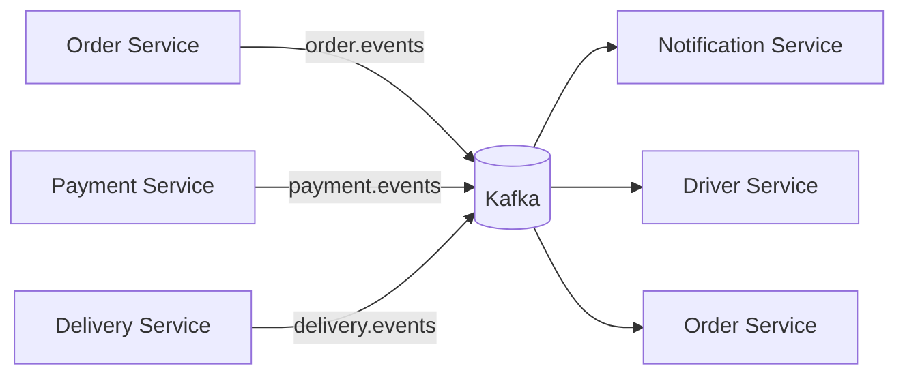

# Event-Driven Design

## Why Kafka is used here

This project uses Kafka as an asynchronous integration backbone between services. The purpose is to decouple status changes and downstream reactions from synchronous HTTP calls, but the current implementation is partial and remains at-least-once with process-local safeguards.

The core event topics are declared in:

- [shared/src/events/topics.ts](../shared/src/events/topics.ts)

The current topics are:

- `order.events`
- `payment.events`
- `delivery.events`

## Event topology

## Topic responsibilities

### order.events

This is the primary orchestration topic. Orders emit events when the lifecycle moves across domain steps, such as:

- creation
- confirmation
- payment approval or failure
- preparation readiness
- pickup assignment
- delivery completion

The order service is the main producer of this topic. Downstream consumers can react without direct HTTP calls.

### payment.events

This topic captures payment state changes and is used to notify people or services that payment is complete, failed, or requires follow-up handling.

Typical consumers include:

- order-service for state updates
- notification-service for user notifications

Delivery semantics (payment-service):

- Events are published **after** the payment row is committed and are **at-least-once**: a retry after a failed or interrupted publish may send the same event again.
- `eventId` is deterministic: UUID v5 of `"<paymentId>:<eventType>"` in a fixed namespace (`PAYMENT_EVENT_NAMESPACE` in `payments.service.ts`). A re-published `payment.completed` for a payment always has the same `eventId`, so consumers must deduplicate by `eventId` (the shared `KafkaConsumerService` already skips ids it has processed; its store is in-memory, so durable dedup across restarts is consumer-side work).
- Each payment emits at most one event per type in normal operation; `publishedEventStatus` on the payment row tracks what was already published.
- The payload shape `{ paymentId, orderId, amount, status }` and event type names are unchanged; `eventId` remains a UUID, so existing consumers are unaffected.
- The order-service status update is a separate HTTP call, not driven by the event; it is tracked the same way (`orderSyncedStatus`) and retried by the client's next `process`/create retry, not by Kafka.

### delivery.events

This topic is intended to capture delivery lifecycle changes:

- assignment to driver
- pickup started
- vehicle in transit
- delivery completed
- cancellation or failure

This is primarily relevant to delivery, tracking, and notification flows. The delivery service currently defines the event publisher and event-building code, but its lifecycle methods do not invoke publication consistently; treat delivery event propagation as partial.

## Event-driven patterns in the repository

### 1. Command and notification separation

Service APIs handle immediate command requests, while Kafka is used for background propagation of events.

Example pattern:

- user places order via gateway
- order-service validates and persists order
- order-service publishes an order lifecycle event
- other services react asynchronously

### 2. Persistence + projection model

The system keeps authoritative state in each service’s database, while Kafka events act as integration messages. This is a classic event-driven microservice pattern rather than a distributed transaction design.

The repository does not implement a centralized event store. Instead, each service persists its own domain truth and listens for only the events that matter to it.

### 3. Event consumer responsibilities

Services react to incoming events by updating their own internal state or creating follow-up side effects:

- `notification-service` subscribes to order/payment/delivery topics and persists order notifications; payment and delivery handlers currently contain no-op behavior because the required lookup/contract work is not implemented
- `driver-service` can react to delivery events when the lifecycle affects driver availability
- `order-service` can adjust its internal state based on payment or delivery outcomes

## Why this matters for maintainers

A key design principle in this repo is:

- the service database owns the current truth
- Kafka carries the change signal
- each consumer decides how to react

This avoids a single shared database but still allows loosely coupled coordination across services.

## Current implementation status

The repo contains an explicit Kafka topic registry and event-driven service relationships, but the event payload schema is still lightweight and mostly code-structure-driven rather than a fully mature contract registry.

Most of the actual event contracts are established implicitly through:

- shared topic names
- service-specific event listeners
- message content created by each producer

This means the project is best understood as a practical microservice event bus rather than a strict event-sourcing system.

### Reliability boundaries

- Consumer retries are limited to three attempts with exponential backoff in the process.
- Processed event IDs are stored in an in-memory `Set`; the state is lost on restart and is not shared across replicas.
- Exhausted messages are logged and their offsets are committed; no real dead-letter topic or persistence path is implemented.
- Payment events use deterministic event IDs and retry-aware payment markers, but publication remains at-least-once.
- A versioned event registry, runtime validation, durable deduplication, and DLQ handling remain roadmap work.

## Source of truth

For exact topic names, see:

- [shared/src/events/topics.ts](../shared/src/events/topics.ts)

For service-level wiring and relationship assumptions, see:

- [docs/services/order-service.md](../docs/services/order-service.md)
- [docs/services/payment-service.md](../docs/services/payment-service.md)
- [docs/services/delivery-service.md](../docs/services/delivery-service.md)
- [docs/services/notification-service.md](../docs/services/notification-service.md)
- [docs/services/driver-service.md](../docs/services/driver-service.md)
