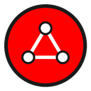
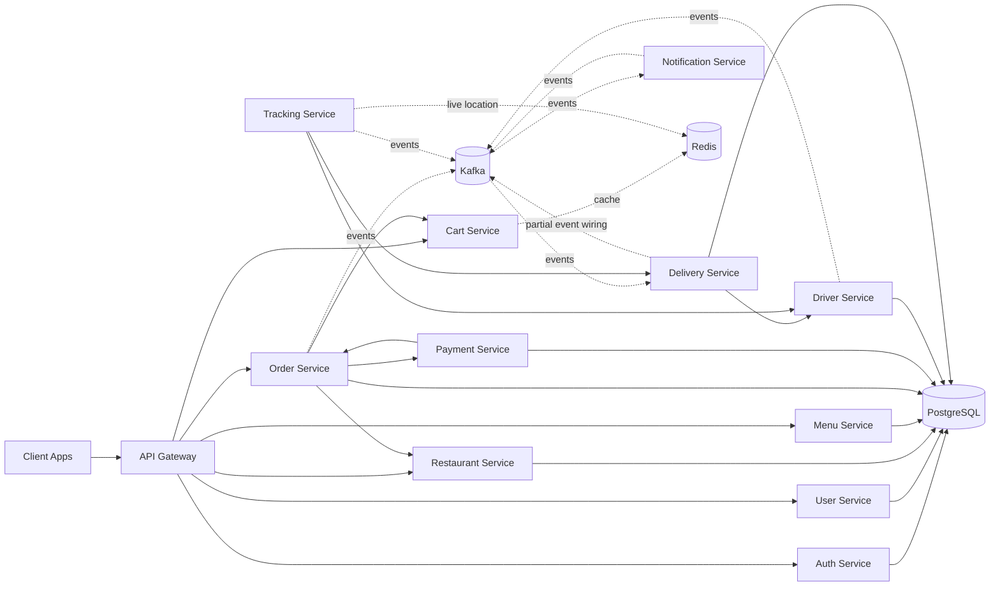
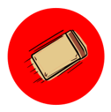

<p align="center">
  
</p>

<h3 align="center">A cloud-native, event-driven microservices platform for on-demand delivery</h3>

<p align="center">
  <a href="./LICENSE"></a>
  = 18">
  
  
  
  
  
  
</p>

<p align="center">
  
  
  
  
  
</p>

<p align="center">
  <a href="#-architecture">Architecture</a> ·
  <a href="#-tech-stack">Tech Stack</a> ·
  <a href="#-services">Services</a> ·
  <a href="#-getting-started">Getting Started</a> ·
  <a href="#-testing">Testing</a> ·
  <a href="#-contributing">Contributing</a> ·
  <a href="#-license">License</a>
</p>

---

##  Overview

**Delivery Plus** is a backend food-delivery platform built as independently deployable **microservices** that communicate over REST and **Kafka** events. Domain responsibilities are separated across auth, users, restaurants, menus, carts, orders, payments, drivers, deliveries, tracking, and notifications. PostgreSQL-backed services own relational data; cart and tracking use Redis; the gateway owns no domain data.

This is a **backend-only** repository — no frontend/UI is included here by design. It's meant to be consumed by web, mobile, or third-party clients through the **API Gateway**.

##  Architecture



Every service is self-contained and shares a common foundation through the internal `shared` library. The shared package provides enums, transition helpers, Kafka/Redis helpers, JWT and role guards, logging, and common NestJS utilities. Kafka reliability is currently limited: retries are process-local, deduplication is in-memory, and the documented DLQ path is not implemented.

##  Tech Stack

| Layer | Technology |
|---|---|
| Language | TypeScript |
| Framework | NestJS |
| Database | PostgreSQL |
| Cache / Real-time state | Redis |
| Messaging / Events | Apache Kafka |
| Containerization | Docker & Docker Compose |
| Testing | Jest (unit + e2e) |
| Shared internals | Custom `shared` package (events, guards, filters, utils) |

##  Services

| Service | Responsibility |
|---|---|
| `api-gateway` | Single entry point, request routing to downstream services |
| `auth-service` | Authentication, credentials, JWT issuing |
| `user-service` | User profiles |
| `restaurant-service` | Restaurant records & status |
| `menu-service` | Menu categories & items, availability |
| `cart-service` | Shopping cart (Redis-backed) |
| `order-service` | Order lifecycle & orchestration |
| `payment-service` | Payment processing |
| `driver-service` | Driver registration & status transitions |
| `delivery-service` | Delivery lifecycle |
| `tracking-service` | Live location tracking (Redis-backed) |
| `notification-service` | User notifications |

The domain services expose `/health` routes used by Compose healthchecks. The API Gateway is an exception: it currently has no health controller, although Compose still probes `/health` on port `3000`; treat that healthcheck as a known runtime gap. Services generally follow `controllers → services → repositories/entities`, with variations by service.

##  Getting Started

### Prerequisites
- Node.js ≥ 18
- Docker & Docker Compose

### Run locally

```bash
# clone the repo
git clone https://github.com/<your-org>/delivery-plus.git
cd delivery-plus

# install dependencies
npm install

# local dev stack: shared infra + application services
# use the default dev workflow for day-to-day development
docker compose -f docker-compose.base.yml -f docker-compose.dev.yml up --build
```

For environment-specific validation:

```bash
# deterministic test layout
docker compose -f docker-compose.base.yml -f docker-compose.test.yml config --quiet

# production-like validation (requires secrets explicitly)
# These values are for Compose configuration validation only and must never be used for deployment.
export POSTGRES_USER="compose_validation_user"
export POSTGRES_PASSWORD="compose_validation_only_7f3c2b"
export POSTGRES_USER_URLENCODED="compose_validation_user"
export POSTGRES_PASSWORD_URLENCODED="compose_validation_only_7f3c2b"
export JWT_SECRET="compose_validation_only_jwt_9a41d8"
docker compose -f docker-compose.base.yml -f docker-compose.prod.yml config --quiet
```

```powershell
# PowerShell equivalent
$env:POSTGRES_USER="compose_validation_user"
$env:POSTGRES_PASSWORD="compose_validation_only_7f3c2b"
$env:POSTGRES_USER_URLENCODED="compose_validation_user"
$env:POSTGRES_PASSWORD_URLENCODED="compose_validation_only_7f3c2b"
$env:JWT_SECRET="compose_validation_only_jwt_9a41d8"
docker compose -f docker-compose.base.yml -f docker-compose.prod.yml config --quiet
```

### API documentation

Each HTTP service exposes Swagger UI at `http://localhost:<service-port>/docs`, and the API Gateway aggregates the service docs at `http://localhost:3000/docs`.

The API Gateway will be available at `http://localhost:3000`; see [`docs/deployment.md`](./docs/deployment.md) for the Compose variants, ports, and environment configuration. The repository contains `scripts/seed.ts` and `scripts/e2e.ts`, but the root `package.json` does not currently expose `npm run seed` or `npm run e2e` scripts.

##  Testing

```bash
# unit tests for a given service
npm run test --workspace=services/order-service

# complete repository validation used by CI
npm run verify
```

`npm run verify` runs workspace lint, tests, and builds. CI also validates Compose syntax, builds the API Gateway image, and runs Trivy filesystem and image scans. It does not start the full stack or run the E2E script.

##  Documentation

- [`docs/architecture.md`](./docs/architecture.md) — deep dive into service boundaries & event flows
- [`docs/deployment.md`](./docs/deployment.md) — environment variables, ports, deployment guide
- [`docs/services.md`](./docs/services.md) — per-service API reference

##  Contributing

Contributions are what make open source great. Please read [`CONTRIBUTING.md`](./CONTRIBUTING.md) and our [`CODE_OF_CONDUCT.md`](./CODE_OF_CONDUCT.md) before opening a PR.

1. Fork the repo
2. Create your branch (`git checkout -b feature/amazing-feature`)
3. Commit your changes (`git commit -m 'feat: add amazing feature'`)
4. Push to the branch (`git push origin feature/amazing-feature`)
5. Open a Pull Request

Found a security issue? Please follow the process in [`SECURITY.md`](./SECURITY.md) instead of opening a public issue.

##  License

Distributed under the **MIT License**. See [`LICENSE`](./LICENSE) for details.

---

<p align="center">
  
  Made by the Delivery Plus team
</p>