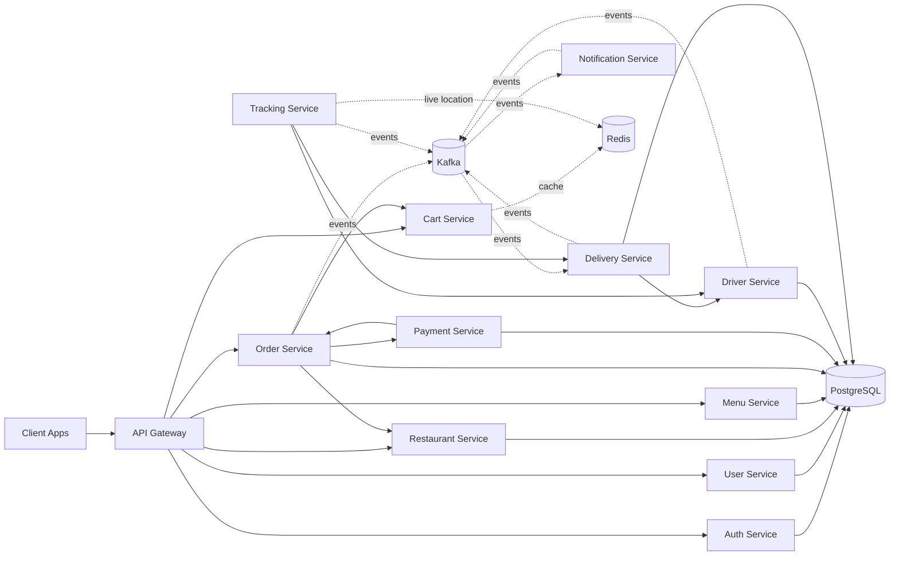

<p align="center">
  
</p>

<h3 align="center">A cloud-native, event-driven microservices platform for on-demand delivery</h3>

<p align="center">
  <a href="./LICENSE"></a>
  = 18">
  
  
  
  
  
  
</p>

<p align="center">
  
  
  
  
  
</p>

<p align="center">
  <a href="#-architecture">Architecture</a> ·
  <a href="#-tech-stack">Tech Stack</a> ·
  <a href="#-services">Services</a> ·
  <a href="#-getting-started">Getting Started</a> ·
  <a href="#-testing">Testing</a> ·
  <a href="#-contributing">Contributing</a> ·
  <a href="#-license">License</a>
</p>

---

##  Overview

**Delivery Plus** is the backend engine behind a full-scale food delivery platform, built as a set of independently deployable **microservices** that communicate over REST and **Kafka** events. Every domain — auth, restaurants, menus, carts, orders, payments, drivers, deliveries, tracking, notifications and users — lives in its own service with its own database access layer, so teams can build, test, and ship each piece on its own schedule without stepping on each other.

This is a **backend-only** repository — no frontend/UI is included here by design. It's meant to be consumed by web, mobile, or third-party clients through the **API Gateway**.

##  Architecture



Every service is self-contained (own `src`, `dto`, `entities`, `repositories`, `controllers`) and shares a common foundation through the internal `shared` library — logging, Kafka producer/consumer, Redis caching, JWT/roles guards, error handling, and correlation-ID middleware.

##  Tech Stack

| Layer | Technology |
|---|---|
| Language | TypeScript |
| Framework | NestJS |
| Database | PostgreSQL |
| Cache / Real-time state | Redis |
| Messaging / Events | Apache Kafka |
| Containerization | Docker & Docker Compose |
| Testing | Jest (unit + e2e) |
| Shared internals | Custom `shared` package (events, guards, filters, utils) |

##  Services

| Service | Responsibility |
|---|---|
| `api-gateway` | Single entry point, request routing to downstream services |
| `auth-service` | Authentication, credentials, JWT issuing |
| `user-service` | User profiles |
| `restaurant-service` | Restaurant records & status |
| `menu-service` | Menu categories & items, availability |
| `cart-service` | Shopping cart (Redis-backed) |
| `order-service` | Order lifecycle & orchestration |
| `payment-service` | Payment processing |
| `driver-service` | Driver registration & status transitions |
| `delivery-service` | Delivery lifecycle |
| `tracking-service` | Live location tracking (Redis-backed) |
| `notification-service` | User notifications |

Each service exposes a `/health` endpoint and follows the same internal layout: `controllers → services → repositories → entities`.

##  Getting Started

### Prerequisites
- Node.js ≥ 18
- Docker & Docker Compose

### Run locally

```bash
# clone the repo
git clone https://github.com/<your-org>/delivery-plus.git
cd delivery-plus

# install dependencies
npm install

# spin up Postgres, Redis, Kafka and every service
docker-compose up --build
```

### Seed sample data

```bash
npm run seed
```

The API Gateway will be available at `http://localhost:<gateway-port>` — see [`docs/deployment.md`](./docs/deployment.md) for full port/env configuration.

##  Testing

```bash
# unit tests for a given service
npm run test --workspace=services/order-service

# end-to-end tests across the stack
npm run e2e
```

##  Documentation

- [`docs/architecture.md`](./docs/architecture.md) — deep dive into service boundaries & event flows
- [`docs/deployment.md`](./docs/deployment.md) — environment variables, ports, deployment guide
- [`docs/services.md`](./docs/services.md) — per-service API reference

##  Contributing

Contributions are what make open source great. Please read [`CONTRIBUTING.md`](./CONTRIBUTING.md) and our [`CODE_OF_CONDUCT.md`](./CODE_OF_CONDUCT.md) before opening a PR.

1. Fork the repo
2. Create your branch (`git checkout -b feature/amazing-feature`)
3. Commit your changes (`git commit -m 'feat: add amazing feature'`)
4. Push to the branch (`git push origin feature/amazing-feature`)
5. Open a Pull Request

Found a security issue? Please follow the process in [`SECURITY.md`](./SECURITY.md) instead of opening a public issue.

##  License

Distributed under the **MIT License**. See [`LICENSE`](./LICENSE) for details.

---

<p align="center">
  
  Made by the Delivery Plus team
</p>